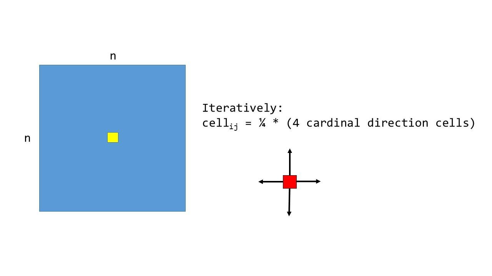

# Homework 6, due 10/15

## Coding problem, 1D Heat Transfer

Imagine we have an `nxn` metal plate which is at an equilibrium temperature of 0 at all locations. We then instantaneously heat the 4 central cells of the grid to some temperature `T` and the heat source removed. We would like to know the temperature of the cells of the plate at some time point in the future from the initial heating.

We can do this iteratively by stepping forward in time. At some time `t` we can calculate the temperature of a cell by averaging the temperature of the 4 cardinal direction cells. We wish to do the calculation in parallel using OpenMP.

## Outline
- Takes in 5 command line arguments
	+ the dimension `n`, the size of the square plate
	+ the number of threads
	+ the inital temp of the 4 central cells
		* as mentioned, all cells are initialized to 0 except for those 4 cells
	+ the number of timesteps to take.
	+ a tolerance
	
- the top and bottom rows, as well as the leftmost and rightmost columns, will be missing 1 neighbor. The 4 corners will be missing 2 neighbors. Assume all missing neighbors have a temp 0 for the duration of the simulation.
- timestep vs tolerance: The maximum number of timesteps to take is provided as an argument. However, if the tolerance criteria is reached before the timestep limit, the calculation ends. The tolerance criteria is achieved when the *largest* difference between two cells in the simulation (between time steps) is equal or less than the tolerance.

## Turn in
- your code
- a report that includes a table with:
	+ for a single thread (and starting conditions) how long (in time) the simulation took and did it ever reach equilibrium first
		* if it reached equilibrium, what was the tolearance?
	+ repeat with different thread counts (up to twice the number of cores on your computer), reporting time taken (iterations should be the same?)

## Working together
When you are in a group, work together. For example, pick a classmate to be the "driver" and do all the actual typing of the code. The driver should share their screen. The other group members will be "navigators," guiding the overall direction of the code toward the ultimate goal. Feel free to switch roles as frequently as needed. Feel free to discuss the programming problem with your other group mates, too. At the conclusion, you may submit identical code and write-ups as your group mates, specifying your group members. 

